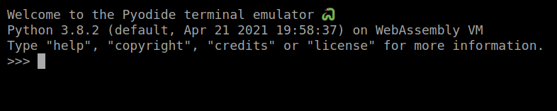

Pyodide
================================================================================

🐍 Pyodide is a Python runtime in the browser, powered by WebAssembly.

Getting Started
--------------------------------------------------------------------------------

🖥 [Start the REPL](https://pyodide.org/en/stable/console.html) 

⚠ Using the REPL means downloading the WebAssembly version of Python.
6.30 MB of data have to be downloaded first; starting the REPL will
also take some time. Expect typically between 1 and 10 seconds 
to get started.
